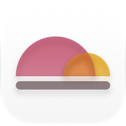

# RoomCurve

An open-source iOS app for tuning audio systems: measure your room with your phone, see how it
sounds against a target curve, and generate room-correction filters for whatever DSP you own.

A native replacement for [HouseCurve](https://housecurve.com). No dependencies — Accelerate for
the maths, AVFoundation for audio, SwiftUI and Swift Charts for the interface.

## What it does

| Tool | |
|---|---|
| **Sweep** | Logarithmic sine sweep, deconvolved to an impulse response. Magnitude, phase and group delay. |
| **Real Time** | Pink-noise analyser. Live, or a long average for walking the mic around the room. |
| **Equalize** | Generates parametric or FIR correction towards a target curve. |
| **Curve Editor** | Drag points to shape a target curve, or paste the numbers in. |
| **Measurements** | Saved impulse responses, target curves and microphone calibrations. |

Export goes to: RoomCurve JSON, AutoEQ/REW `ParametricEQ.txt`, Equalizer APO, miniDSP biquad
coefficients, CamillaDSP YAML, mpv/IINA filter chains, impulse-response WAV, and printable cards
for equalisers with no import at all.

## Three things it does differently

**Microphone calibration you can verify.** Paid apps bake in an unpublished correction for the
built-in mic. RoomCurve ships calibrations as editable text files that say where they came from,
including a real anechoic measurement of the iPhone 17 Pro
([Faber Acoustical](https://www.faberacoustical.com/blog/2025/ios/iphone/measured-iphone-17-pro-microphone-frequency-response-and-directivity/)).
You can also **derive your own**: measure a speaker with a reference mic, measure it again with
the phone from the same spot, and the difference is your phone. Those files are worth sharing —
PRs welcome.

That measurement is also a useful corrective. The commonly repeated line is that iPhone mics
"roll off below 60 Hz". The measured curve is −3.5 dB at 50 Hz, −7 dB at 31.5 Hz and −15 dB at
20 Hz. If you have ever measured bass with a phone and trusted it, that is the error you were
carrying.

**An interchange format that states its conventions.** Filter sets are stored as frequency, gain
and Q — never as biquad coefficients, which bake in a sample rate and are silently wrong at any
other. The JSON format writes down the three things that quietly corrupt filters moving between
tools: whether a shelf frequency is the corner or the midpoint, what Q means, and where the
preamp sits.

**It refuses to do the harmful thing.** The auto-EQ caps boost across the whole filter chain, not
just per filter, and rejects boosts that would ring. Both exist to stop it filling in a narrow
null — which flattens the one seat you measured from and makes every other seat worse.

## Building

Requires Xcode 26 or later, iOS 17+.

> **If you re-export the icon from Icon Composer** and the build fails with
> `Could not open "RoomCurve.icon"` and a nil-insertion exception, delete the top-level
> `"features"` key from `RoomCurve/RoomCurve.icon/icon.json`. Beta versions of Icon Composer
> write schema keys the released `actool` cannot parse. The per-group `refractivity` setting is
> separate and can stay — the icon renders identically without the top-level declaration.

```sh
swift test --package-path RoomCurveKit     # 80 tests, about a second, no simulator needed
open RoomCurve/RoomCurve.xcodeproj
```

The DSP lives in `RoomCurveKit`, a plain Swift package with no UI, so the maths can be tested on
any machine. The end-to-end test measures a synthetic room through the full pipeline — sweep
generation, deconvolution, windowing, analysis — and checks the recovered response against what
the room actually is.

In debug builds any screen can be opened directly with synthetic data:

```sh
xcrun simctl launch <device> studio.ooyang.RoomCurve -demoScreen sweep
```

## How to get a good measurement

1. Connect with a cable if you can. Wireless works, but some AirPlay and Bluetooth endpoints
   mangle short signals, and their clock drifts against the phone's.
2. Start quiet, then raise the volume until the sweep is clearly audible at a normal listening
   level.
3. Point the microphone at the speaker. The phone's own body shadows it by several dB above
   3 kHz. Take the case off.
4. Measure several positions around the listening area and let the app average them.
5. Match speaker levels, then crossovers, then time alignment. Equalise last.

If the phone cannot reach your system at all, turn on **external stimulus**, export the test
signal, and play it from the system itself. The app just listens; the timing chirp does the rest.

## Approach

Every curve — measurement, target, filter response, prediction, calibration — lives on one shared
1/48-octave grid from 20 Hz to 20 kHz. Comparison, curve fitting, EQ error and calibration are
then all elementwise array maths, which is what keeps a room-correction app small enough to have
no dependencies.

Built on the published method rather than invented: Farina's swept-sine deconvolution, the RBJ
cookbook for filter coefficients, and REW's documented practice for windowing, smoothing,
averaging and EQ constraints.

## Licence

MIT.
